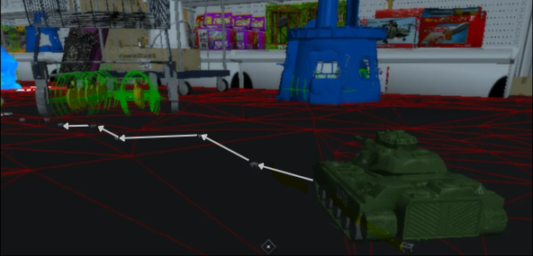
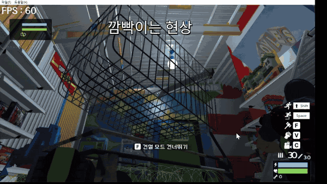
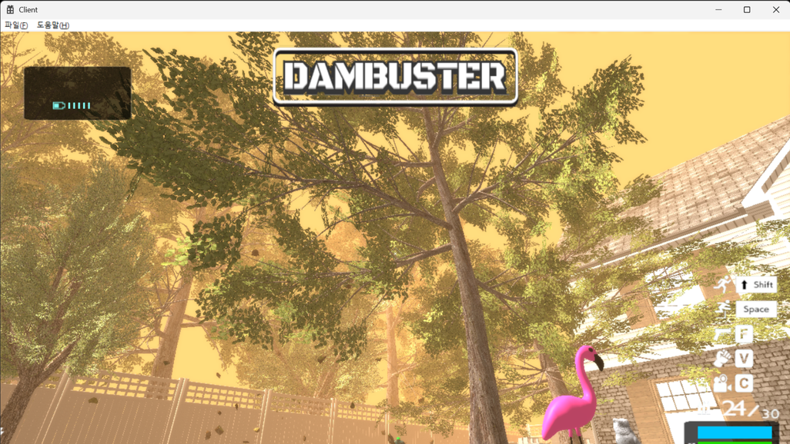
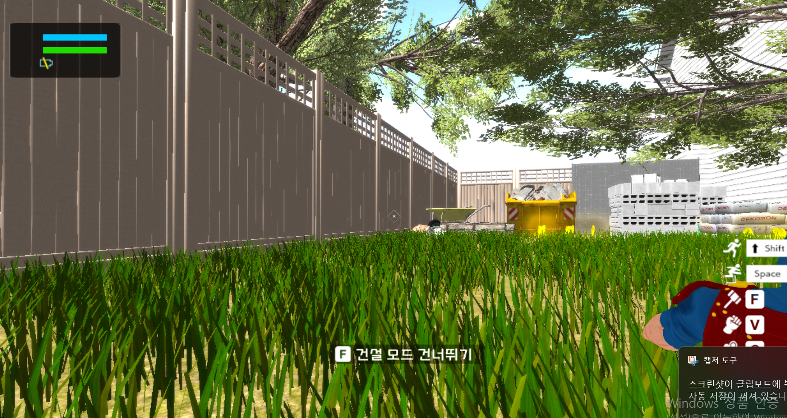
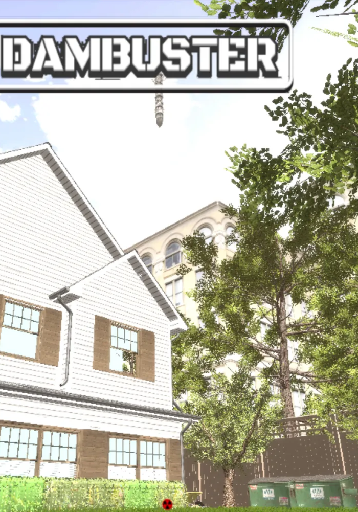
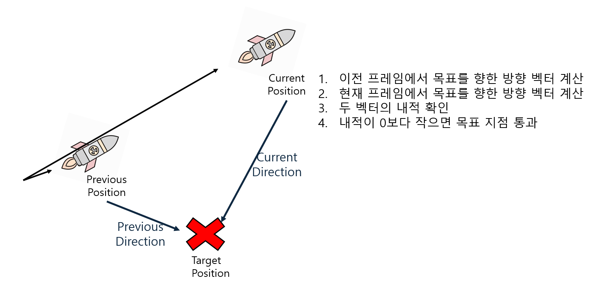
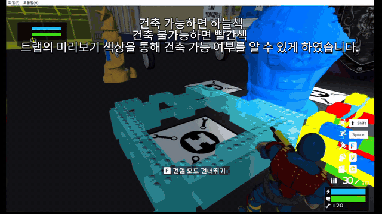

# [DirectX 11] Hypercharge Unboxed 모작

DirectX 11로 Hypercharge Unboxed를 모작한 개인 프로젝트입니다. FPS/TPS 슈팅에 디펜스 요소를 더해 적 웨이브를 막고, 건축 시간에는 트랩을 설치할 수 있도록 구현했습니다.

### 개인 프로젝트

- 개발 기간 : 2024.08.18 ~ 2024.12.02
- 리팩터링 기간 : 2025.07.15 ~ 2025.08.18
- 장르 : FPS / TPS, 슈팅, 디펜스
- 개발 환경 : C++, DirectX 11, HLSL, ImGui
- 플레이 영상 : [YouTube](https://youtu.be/l3Br0U6yNuE)

# 구현 내용

## 1. 20마리 이상 동시 A* 길찾기 최적화

### 문제

Navigation Cell이 1,000개 이상인 복잡한 맵에서 몬스터 20마리 이상이 동시에 길찾기를 요청하면 프레임 드랍이 발생했습니다.

### 결과

| 항목 | 개선 전 | 개선 후 |
| --- | --- | --- |
| 탐색 노드 구성 | 삼각형 Cell의 세 꼭짓점을 각각 노드로 사용 | 삼각형 Cell의 무게중심 하나만 노드로 사용 |
| Cell당 탐색 노드 | 3개 | 1개 · 전체 탐색 노드 수 **1/3 이하** |
| OpenList | 선형 탐색 | 우선순위 큐 |
| 평균 탐색 시간 | 0.261ms | **0.230ms · 약 12% 감소** |

동일한 몬스터 수를 유지한 상태에서 동시 길찾기로 발생하던 프레임 드랍을 **약 5 FPS 완화**했습니다.

### 해결 과정

| 단계 | 개선 내용 |
| --- | --- |
| **01 · 탐색 횟수 감소** | 주기적 탐색을 제거하고 최초 등장과 재탐색 이벤트에서만 A* 요청 |
| **02 · 탐색 구조 개선** | Cell의 세 꼭짓점을 무게중심 하나로 변경하고 OpenList를 우선순위 큐로 교체 |
| **03 · 연산 분리** | Thread Pool은 경로만 계산하고 완료된 결과는 메인 스레드에서 몬스터에게 반영 |

## 2. Bloom 구현 및 깜빡임 해결

  

총구 화염과 폭발처럼 강한 빛을 표현하기 위해 Bloom 후처리를 구현했습니다.

| 과정 | 구현 및 문제 해결 |
| --- | --- |
| **1. 밝은 영역 추출** | 화면에서 밝은 색상을 추출해 Bloom을 적용했지만, 의도하지 않은 밝은 객체에도 효과가 적용됐습니다. |
| **2. 렌더 그룹 분리** | Bloom이 필요한 객체만 별도 렌더 그룹으로 분리해 적용 대상을 제어했습니다. |
| **3. 다운·업샘플링 적용** | 원본 해상도에서 픽셀을 중첩하면서 발생한 프레임 드랍을 줄이기 위해 해상도를 낮춰 Bloom을 계산한 뒤 다시 합성했습니다. |
| **4. 깜빡임 해결** | 4·16·32·64배로 과도하게 낮춘 해상도 때문에 카메라 이동 시 깜빡임이 발생해, 단계를 **4·8배**로 줄여 더 넓은 범위의 픽셀 평균값을 사용했습니다. |

최종적으로 Bloom 적용 대상을 구분하면서 연산 부하와 카메라 이동 시 발생하던 깜빡임을 함께 줄였습니다.

## 3. Depth 기반 Fog

- 미사일이 떨어진 위치를 기준으로 먼지와 빛이 퍼지는 핵폭발 분위기를 표현했습니다.
- 화면의 **Depth 값**을 이용해 거리가 멀어질수록 Fog 강도가 선형적으로 증가하도록 구현했습니다.

## 4. 렌더링 최적화

### Instancing

반복 배치되는 잔디의 World Matrix를 묶어 동일 Mesh를 **한 번의 Draw Call**로 렌더링했습니다.

### Frustum Culling

카메라 시야 밖 객체를 렌더링 대상에서 제외해 불필요한 렌더링 부하를 줄였습니다.

## 5. 내적 기반 미사일 목표 통과 감지

<table>
  <tr>
    <td width="32%" align="center">
      
    </td>
    <td width="68%" align="center">
      
    </td>
  </tr>
</table>

- 이전 위치와 현재 위치에서 목표를 향하는 두 방향 벡터를 계산합니다.
- 두 벡터의 **내적이 음수**가 되는 순간 목표 지점을 통과한 것으로 판단합니다.
- 통과 후 목표 추적을 멈추고 미사일을 낙하 상태로 전환합니다.

## 6. 트랩 건축 시스템

  

건축·정비 시간에 아이템과 코인을 사용해 정해진 위치에 트랩을 설치합니다. 설치 가능 여부는 Shader 색상으로 구분했습니다.

- **파란색**: 건축 가능
- **빨간색**: 건축 불가
